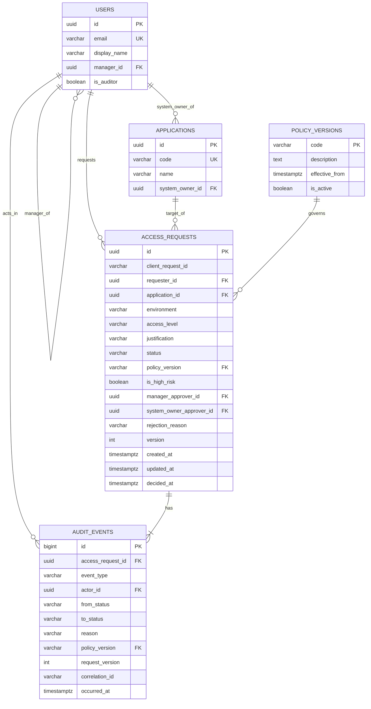

# 01 — Database Design (PostgreSQL)

Dokumen ini adalah rancangan database untuk **Access Request Hub – Phase 1**.

**Source of truth tetap EF Core migration.** SQL di dokumen ini adalah *referensi dan alat review*: setelah migration dibuat, jalankan
`dotnet ef migrations script --idempotent -o db/schema.sql` lalu bandingkan hasilnya dengan dokumen ini. Kalau berbeda, yang benar adalah migration, dan dokumen ini harus diperbarui.

---

## 1. Prinsip desain

| Prinsip | Implementasi |
|---|---|
| Invariant penting harus tetap aman walaupun ada bug di aplikasi atau race condition | Unique index, foreign key, CHECK constraint, dan trigger guard di database, bukan hanya validasi di C# |
| Idempotency create request | `UNIQUE (requester_id, client_request_id)` |
| Hanya satu transisi per version | Kolom `version` sebagai concurrency token **dan** `UNIQUE (access_request_id, request_version)` di `audit_events` |
| Audit atomic dengan perubahan state | Update `access_requests` + insert `audit_events` dalam satu transaksi (`SaveChanges`) |
| Audit append-only | Trigger yang menolak `UPDATE`, `DELETE`, dan `TRUNCATE` pada `audit_events` |
| Request lama tetap bisa dijelaskan saat policy berubah | `policy_version`, `is_high_risk`, dan approver di-*snapshot* saat request dibuat |
| Terminal state final | Trigger menolak perubahan apa pun setelah `Approved` / `Rejected` |
| Semua request mulai dari Manager approval | Trigger insert guard: row baru wajib `PendingManagerApproval` + `version = 1` |

### Keputusan desain yang perlu ditulis di PLAN.md

1. **Scope idempotency key per requester.** Unique key-nya `(requester_id, client_request_id)`, bukan `client_request_id` saja, supaya key milik user A tidak bisa "bertabrakan" dengan key user B.
2. **Approver di-snapshot saat create.** `manager_approver_id` dan `system_owner_approver_id` disimpan di row request. Authorization approve/reject dicek terhadap snapshot ini. Alasannya: kalau di kemudian hari manager atau system owner berganti, request lama tetap jelas siapa yang seharusnya memproses.
3. **`is_high_risk` disimpan, bukan dihitung ulang.** Nilainya ditentukan oleh policy yang aktif saat request dibuat. Di Phase 2, definisi high-risk bisa berubah tanpa mengubah arti request lama.
4. **Enum disimpan sebagai text + CHECK constraint**, bukan PostgreSQL enum type. Lebih mudah dibaca saat review dan lebih mudah diubah lewat migration di Phase 2.
5. **Naming snake_case** via package `EFCore.NamingConventions` (`UseSnakeCaseNamingConvention()`).

### Asumsi (tulis juga di PLAN.md / REVIEW.md)

- User yang **tidak punya manager** (Bob, Carol, Dana, Erin di seed) tidak bisa membuat request. Backend mengembalikan `422 NO_MANAGER`.
- Kalau request high-risk dan **System Owner aplikasi = requester** (misalnya Carol meminta akses CRM Production), tidak ada approver yang sah. Request ditolak saat create dengan `422 NO_ELIGIBLE_APPROVER`, supaya tidak ada request yang macet selamanya.

---

## 2. ERD



---

## 3. State model

```
                 approve (low-risk)
PendingManagerApproval ─────────────────────────────► Approved   (terminal)
        │  │
        │  └── approve (high-risk) ──► PendingSystemOwnerApproval ── approve ──► Approved
        │                                         │
        └── reject ──► Rejected (terminal)        └── reject ──► Rejected
```

| From | Event | To | Siapa |
|---|---|---|---|
| *(baru)* | Create | `PendingManagerApproval` | Requester |
| `PendingManagerApproval` | Approve, low-risk | `Approved` | `manager_approver_id` |
| `PendingManagerApproval` | Approve, high-risk | `PendingSystemOwnerApproval` | `manager_approver_id` |
| `PendingManagerApproval` | Reject | `Rejected` | `manager_approver_id` |
| `PendingSystemOwnerApproval` | Approve | `Approved` | `system_owner_approver_id` |
| `PendingSystemOwnerApproval` | Reject | `Rejected` | `system_owner_approver_id` |
| `Approved` / `Rejected` | apa pun | ditolak (409) | — |

`version` dimulai dari `1` saat create dan naik tepat `+1` di setiap transisi.

---

## 4. DDL (CREATE TABLE)

> Urutan eksekusi: `users` → `applications` → `policy_versions` → `access_requests` → `audit_events` → trigger → seed.

### 4.1 `users`

```sql
CREATE TABLE users (
    id            uuid         NOT NULL,
    email         varchar(256) NOT NULL,
    display_name  varchar(100) NOT NULL,
    manager_id    uuid         NULL,
    is_auditor    boolean      NOT NULL DEFAULT false,

    CONSTRAINT pk_users PRIMARY KEY (id),
    CONSTRAINT fk_users_manager FOREIGN KEY (manager_id) REFERENCES users (id) ON DELETE RESTRICT,
    CONSTRAINT ck_users_email_lowercase CHECK (email = lower(email)),
    CONSTRAINT ck_users_not_own_manager CHECK (manager_id IS NULL OR manager_id <> id)
);

CREATE UNIQUE INDEX ux_users_email ON users (email);
```

### 4.2 `applications`

```sql
CREATE TABLE applications (
    id               uuid         NOT NULL,
    code             varchar(50)  NOT NULL,
    name             varchar(100) NOT NULL,
    system_owner_id  uuid         NOT NULL,

    CONSTRAINT pk_applications PRIMARY KEY (id),
    CONSTRAINT fk_applications_system_owner FOREIGN KEY (system_owner_id) REFERENCES users (id) ON DELETE RESTRICT
);

CREATE UNIQUE INDEX ux_applications_code ON applications (code);
```

### 4.3 `policy_versions`

```sql
CREATE TABLE policy_versions (
    code            varchar(10)  NOT NULL,
    description     text         NOT NULL,
    effective_from  timestamptz  NOT NULL,
    is_active       boolean      NOT NULL DEFAULT false,

    CONSTRAINT pk_policy_versions PRIMARY KEY (code)
);

-- Hanya boleh ada SATU policy aktif pada satu waktu
CREATE UNIQUE INDEX ux_policy_versions_single_active
    ON policy_versions (is_active)
    WHERE is_active;
```

### 4.4 `access_requests`

```sql
CREATE TABLE access_requests (
    id                        uuid           NOT NULL,
    client_request_id         varchar(64)    NOT NULL,
    requester_id              uuid           NOT NULL,
    application_id            uuid           NOT NULL,
    environment               varchar(20)    NOT NULL,
    access_level              varchar(10)    NOT NULL,
    justification             varchar(1000)  NOT NULL,
    status                    varchar(40)    NOT NULL,
    policy_version            varchar(10)    NOT NULL,
    is_high_risk              boolean        NOT NULL,
    manager_approver_id       uuid           NOT NULL,
    system_owner_approver_id  uuid           NULL,
    rejection_reason          varchar(1000)  NULL,
    version                   integer        NOT NULL DEFAULT 1,
    created_at                timestamptz    NOT NULL,
    updated_at                timestamptz    NOT NULL,
    decided_at                timestamptz    NULL,

    CONSTRAINT pk_access_requests PRIMARY KEY (id),

    CONSTRAINT fk_access_requests_requester      FOREIGN KEY (requester_id)             REFERENCES users (id)            ON DELETE RESTRICT,
    CONSTRAINT fk_access_requests_application    FOREIGN KEY (application_id)           REFERENCES applications (id)     ON DELETE RESTRICT,
    CONSTRAINT fk_access_requests_policy_version FOREIGN KEY (policy_version)           REFERENCES policy_versions (code) ON DELETE RESTRICT,
    CONSTRAINT fk_access_requests_manager        FOREIGN KEY (manager_approver_id)      REFERENCES users (id)            ON DELETE RESTRICT,
    CONSTRAINT fk_access_requests_system_owner   FOREIGN KEY (system_owner_approver_id) REFERENCES users (id)            ON DELETE RESTRICT,

    -- Nilai enum yang valid
    CONSTRAINT ck_access_requests_environment  CHECK (environment  IN ('NonProduction', 'Production')),
    CONSTRAINT ck_access_requests_access_level CHECK (access_level IN ('Read', 'Admin')),
    CONSTRAINT ck_access_requests_status       CHECK (status IN ('PendingManagerApproval', 'PendingSystemOwnerApproval', 'Approved', 'Rejected')),

    -- Field wajib tidak boleh string kosong / spasi saja
    CONSTRAINT ck_access_requests_client_request_id_not_blank CHECK (length(btrim(client_request_id)) > 0),
    CONSTRAINT ck_access_requests_justification_not_blank     CHECK (length(btrim(justification)) > 0),

    CONSTRAINT ck_access_requests_version_positive CHECK (version >= 1),

    -- Requester tidak boleh menjadi approver request miliknya sendiri
    CONSTRAINT ck_access_requests_manager_not_requester CHECK (manager_approver_id <> requester_id),
    CONSTRAINT ck_access_requests_owner_not_requester   CHECK (system_owner_approver_id IS NULL OR system_owner_approver_id <> requester_id),

    -- Reject wajib punya reason; status selain Rejected tidak boleh punya reason
    CONSTRAINT ck_access_requests_rejection_reason CHECK (
        (status = 'Rejected'  AND rejection_reason IS NOT NULL AND length(btrim(rejection_reason)) > 0)
     OR (status <> 'Rejected' AND rejection_reason IS NULL)
    ),

    -- decided_at terisi jika dan hanya jika status terminal
    CONSTRAINT ck_access_requests_decided_at CHECK (
        (status IN ('Approved', 'Rejected')) = (decided_at IS NOT NULL)
    ),

    -- ===== Invariant khusus policy v1 (di-scope ke v1 supaya Phase 2 bisa punya aturan berbeda) =====
    -- High-risk v1 = Production ATAU Admin
    CONSTRAINT ck_access_requests_v1_high_risk_definition CHECK (
        policy_version <> 'v1'
        OR is_high_risk = (environment = 'Production' OR access_level = 'Admin')
    ),
    -- v1: high-risk wajib punya system owner approver, low-risk tidak punya
    CONSTRAINT ck_access_requests_v1_owner_assignment CHECK (
        policy_version <> 'v1'
        OR (is_high_risk = (system_owner_approver_id IS NOT NULL))
    ),
    -- v1: request low-risk tidak pernah masuk tahap System Owner
    CONSTRAINT ck_access_requests_v1_low_risk_no_owner_stage CHECK (
        policy_version <> 'v1'
        OR NOT (status = 'PendingSystemOwnerApproval' AND NOT is_high_risk)
    )
);

-- Idempotency: satu ClientRequestId per requester = satu row bisnis
CREATE UNIQUE INDEX ux_access_requests_requester_client_request_id
    ON access_requests (requester_id, client_request_id);

-- Index untuk query yang sering dipakai
CREATE INDEX ix_access_requests_requester_created     ON access_requests (requester_id, created_at DESC);
CREATE INDEX ix_access_requests_manager_status        ON access_requests (manager_approver_id, status);
CREATE INDEX ix_access_requests_system_owner_status   ON access_requests (system_owner_approver_id, status);
```

### 4.5 `audit_events`

```sql
CREATE TABLE audit_events (
    id                 bigint         GENERATED ALWAYS AS IDENTITY,
    access_request_id  uuid           NOT NULL,
    event_type         varchar(40)    NOT NULL,
    actor_id           uuid           NOT NULL,
    from_status        varchar(40)    NULL,
    to_status          varchar(40)    NOT NULL,
    reason             varchar(1000)  NULL,
    policy_version     varchar(10)    NOT NULL,
    request_version    integer        NOT NULL,   -- version request SETELAH event ini terjadi
    correlation_id     varchar(64)    NULL,
    occurred_at        timestamptz    NOT NULL,

    CONSTRAINT pk_audit_events PRIMARY KEY (id),
    CONSTRAINT fk_audit_events_access_request FOREIGN KEY (access_request_id) REFERENCES access_requests (id) ON DELETE RESTRICT,
    CONSTRAINT fk_audit_events_actor          FOREIGN KEY (actor_id)          REFERENCES users (id)           ON DELETE RESTRICT,
    CONSTRAINT fk_audit_events_policy_version FOREIGN KEY (policy_version)    REFERENCES policy_versions (code) ON DELETE RESTRICT,

    CONSTRAINT ck_audit_events_event_type CHECK (event_type IN (
        'RequestCreated',
        'ManagerApproved', 'ManagerRejected',
        'SystemOwnerApproved', 'SystemOwnerRejected'
    )),
    CONSTRAINT ck_audit_events_reject_has_reason CHECK (
        event_type NOT IN ('ManagerRejected', 'SystemOwnerRejected')
        OR (reason IS NOT NULL AND length(btrim(reason)) > 0)
    )
);

-- Lapisan pengaman kedua untuk concurrency:
-- untuk satu request, hanya boleh ada SATU event per version.
CREATE UNIQUE INDEX ux_audit_events_request_version
    ON audit_events (access_request_id, request_version);

CREATE INDEX ix_audit_events_request_occurred ON audit_events (access_request_id, occurred_at);
```

---

## 5. Trigger guard

Trigger ini menjaga invariant yang tidak bisa diekspresikan dengan CHECK biasa karena butuh membandingkan nilai **lama vs baru**. Dalam alur normal, trigger ini tidak pernah terpicu. Kalau terpicu, artinya ada bug di aplikasi, dan itu memang tujuannya.

> Prioritas: **direkomendasikan**. Kalau waktu sangat mepet, minimal buat trigger append-only (5.2), lalu catat 5.1/5.1b sebagai deferred di REVIEW.md.

### 5.1 Guard update `access_requests`

```sql
CREATE OR REPLACE FUNCTION fn_access_requests_guard_update()
RETURNS trigger
LANGUAGE plpgsql
AS $$
BEGIN
    -- 1) Terminal state final
    IF OLD.status IN ('Approved', 'Rejected') THEN
        RAISE EXCEPTION 'access_request % is terminal (%)', OLD.id, OLD.status
            USING ERRCODE = 'check_violation';
    END IF;

    -- 2) Hanya transisi legal
    IF NOT (
           (OLD.status = 'PendingManagerApproval'
                AND NEW.status IN ('PendingSystemOwnerApproval', 'Approved', 'Rejected'))
        OR (OLD.status = 'PendingSystemOwnerApproval'
                AND NEW.status IN ('Approved', 'Rejected'))
    ) THEN
        RAISE EXCEPTION 'illegal transition % -> % on access_request %', OLD.status, NEW.status, OLD.id
            USING ERRCODE = 'check_violation';
    END IF;

    -- 3) Policy v1: high-risk tidak boleh langsung Approved dari tahap Manager
    IF OLD.policy_version = 'v1'
       AND OLD.is_high_risk
       AND OLD.status = 'PendingManagerApproval'
       AND NEW.status = 'Approved' THEN
        RAISE EXCEPTION 'v1 high-risk request % must go through System Owner approval', OLD.id
            USING ERRCODE = 'check_violation';
    END IF;

    -- 4) version harus naik tepat 1
    IF NEW.version <> OLD.version + 1 THEN
        RAISE EXCEPTION 'version must increment by exactly 1 (old %, new %)', OLD.version, NEW.version
            USING ERRCODE = 'check_violation';
    END IF;

    -- 5) Kolom identitas request tidak boleh diubah setelah dibuat
    IF NEW.id                       IS DISTINCT FROM OLD.id
    OR NEW.requester_id             IS DISTINCT FROM OLD.requester_id
    OR NEW.client_request_id        IS DISTINCT FROM OLD.client_request_id
    OR NEW.application_id           IS DISTINCT FROM OLD.application_id
    OR NEW.environment              IS DISTINCT FROM OLD.environment
    OR NEW.access_level             IS DISTINCT FROM OLD.access_level
    OR NEW.justification            IS DISTINCT FROM OLD.justification
    OR NEW.policy_version           IS DISTINCT FROM OLD.policy_version
    OR NEW.is_high_risk             IS DISTINCT FROM OLD.is_high_risk
    OR NEW.manager_approver_id      IS DISTINCT FROM OLD.manager_approver_id
    OR NEW.system_owner_approver_id IS DISTINCT FROM OLD.system_owner_approver_id
    OR NEW.created_at               IS DISTINCT FROM OLD.created_at
    THEN
        RAISE EXCEPTION 'immutable column changed on access_request %', OLD.id
            USING ERRCODE = 'check_violation';
    END IF;

    RETURN NEW;
END;
$$;

CREATE TRIGGER trg_access_requests_guard_update
    BEFORE UPDATE ON access_requests
    FOR EACH ROW
    EXECUTE FUNCTION fn_access_requests_guard_update();
```

### 5.1b Guard insert `access_requests`

Business rule "semua request membutuhkan Manager approval terlebih dahulu" juga harus tahan bug: request baru **wajib** lahir di `PendingManagerApproval` dengan `version = 1`. CHECK biasa tidak bisa membedakan INSERT dan UPDATE, jadi dipakai trigger kecil.

```sql
CREATE OR REPLACE FUNCTION fn_access_requests_guard_insert()
RETURNS trigger
LANGUAGE plpgsql
AS $$
BEGIN
    IF NEW.status <> 'PendingManagerApproval' OR NEW.version <> 1 THEN
        RAISE EXCEPTION 'new access_request must start at PendingManagerApproval/version 1 (got %/%)',
            NEW.status, NEW.version
            USING ERRCODE = 'check_violation';
    END IF;
    RETURN NEW;
END;
$$;

CREATE TRIGGER trg_access_requests_guard_insert
    BEFORE INSERT ON access_requests
    FOR EACH ROW
    EXECUTE FUNCTION fn_access_requests_guard_insert();
```

> Guard ini **tidak** di-scope ke v1. Kalau CR Phase 2 mengubah status awal, perbarui function ini lewat migration Phase 2.

### 5.2 Audit append-only

```sql
CREATE OR REPLACE FUNCTION fn_audit_events_append_only()
RETURNS trigger
LANGUAGE plpgsql
AS $$
BEGIN
    RAISE EXCEPTION 'audit_events is append-only (% blocked)', TG_OP
        USING ERRCODE = 'insufficient_privilege';
END;
$$;

CREATE TRIGGER trg_audit_events_no_update_delete
    BEFORE UPDATE OR DELETE ON audit_events
    FOR EACH ROW
    EXECUTE FUNCTION fn_audit_events_append_only();

CREATE TRIGGER trg_audit_events_no_truncate
    BEFORE TRUNCATE ON audit_events
    FOR EACH STATEMENT
    EXECUTE FUNCTION fn_audit_events_append_only();
```

> **Dampak ke testing:** karena `TRUNCATE`/`DELETE` diblok, test **tidak bisa** membersihkan data dengan Respawn atau `TRUNCATE`. Gunakan database baru per test class (Testcontainers + `MigrateAsync()`), dan pakai `ClientRequestId` unik di setiap test.
>
> **Catatan untuk REVIEW.md:** trigger ini melindungi dari *normal application flow*. Superuser database tetap bisa `DROP TRIGGER`. Di production, perlindungan tambahannya adalah memisahkan role database aplikasi (tanpa hak `UPDATE`/`DELETE` di `audit_events`). Ini di luar scope assessment.

---

## 6. Seed data

ID dibuat **tetap** (deterministic) supaya test, dokumentasi, dan demo selalu konsisten.

| Entity | ID |
|---|---|
| alice | `00000000-0000-0000-0000-000000000001` |
| bob | `00000000-0000-0000-0000-000000000002` |
| carol | `00000000-0000-0000-0000-000000000003` |
| dana | `00000000-0000-0000-0000-000000000004` |
| erin | `00000000-0000-0000-0000-000000000005` |
| CRM | `10000000-0000-0000-0000-000000000001` |
| Finance Portal | `10000000-0000-0000-0000-000000000002` |

```sql
-- Policy
INSERT INTO policy_versions (code, description, effective_from, is_active) VALUES
    ('v1',
     'High-risk = Environment Production OR AccessLevel Admin. Semua request butuh Manager approval; high-risk lanjut ke System Owner approval.',
     '2026-01-01T00:00:00Z',
     true)
ON CONFLICT (code) DO NOTHING;

-- Users (Bob diinsert sebelum Alice karena Alice.manager_id -> Bob)
INSERT INTO users (id, email, display_name, manager_id, is_auditor) VALUES
    ('00000000-0000-0000-0000-000000000002', 'bob@example.local',   'Bob',   NULL,                                   false),
    ('00000000-0000-0000-0000-000000000001', 'alice@example.local', 'Alice', '00000000-0000-0000-0000-000000000002', false),
    ('00000000-0000-0000-0000-000000000003', 'carol@example.local', 'Carol', NULL,                                   false),
    ('00000000-0000-0000-0000-000000000004', 'dana@example.local',  'Dana',  NULL,                                   false),
    ('00000000-0000-0000-0000-000000000005', 'erin@example.local',  'Erin',  NULL,                                   true)
ON CONFLICT (id) DO NOTHING;

-- Applications
INSERT INTO applications (id, code, name, system_owner_id) VALUES
    ('10000000-0000-0000-0000-000000000001', 'CRM',            'CRM',            '00000000-0000-0000-0000-000000000003'),
    ('10000000-0000-0000-0000-000000000002', 'FINANCE_PORTAL', 'Finance Portal', '00000000-0000-0000-0000-000000000004')
ON CONFLICT (id) DO NOTHING;
```

Di EF Core, seed ini dimasukkan lewat `HasData(...)` di entity configuration supaya ikut ter-generate di migration. Dengan begitu `dotnet ef database update` sudah sekaligus membuat schema **dan** seed.

> Environment (`NonProduction`, `Production`) dan AccessLevel (`Read`, `Admin`) **tidak** dibuat tabel tersendiri. Keduanya adalah enum yang dijaga oleh CHECK constraint. Ini trade-off yang wajar untuk scope Phase 1; tulis alasannya di PLAN.md.

---

## 7. Contoh operasi (yang akan dihasilkan EF Core)

### 7.1 Create request + audit dalam satu transaksi

```sql
BEGIN;

INSERT INTO access_requests (
    id, client_request_id, requester_id, application_id, environment, access_level,
    justification, status, policy_version, is_high_risk,
    manager_approver_id, system_owner_approver_id, rejection_reason,
    version, created_at, updated_at, decided_at
) VALUES (
    '7b0c0e2a-5d1e-4c55-9a51-2d7c1f6f2a01', 'c7f1b0d4-demo-0001',
    '00000000-0000-0000-0000-000000000001',   -- alice
    '10000000-0000-0000-0000-000000000001',   -- CRM
    'Production', 'Read',
    'Perlu membaca data customer untuk investigasi tiket support.',
    'PendingManagerApproval', 'v1', true,
    '00000000-0000-0000-0000-000000000002',   -- bob
    '00000000-0000-0000-0000-000000000003',   -- carol
    NULL, 1, now(), now(), NULL
);

INSERT INTO audit_events (
    access_request_id, event_type, actor_id, from_status, to_status,
    reason, policy_version, request_version, correlation_id, occurred_at
) VALUES (
    '7b0c0e2a-5d1e-4c55-9a51-2d7c1f6f2a01', 'RequestCreated',
    '00000000-0000-0000-0000-000000000001', NULL, 'PendingManagerApproval',
    NULL, 'v1', 1, 'corr-123', now()
);

COMMIT;
```

### 7.2 Transisi dengan optimistic concurrency

```sql
BEGIN;

UPDATE access_requests
SET    status = 'PendingSystemOwnerApproval',
       version = 2,
       updated_at = now()
WHERE  id = '7b0c0e2a-5d1e-4c55-9a51-2d7c1f6f2a01'
  AND  version = 1;          -- concurrency token
-- rows affected = 0  ->  ada yang sudah memproses duluan  ->  ROLLBACK, API balas 409

INSERT INTO audit_events (access_request_id, event_type, actor_id, from_status, to_status,
                          reason, policy_version, request_version, correlation_id, occurred_at)
VALUES ('7b0c0e2a-5d1e-4c55-9a51-2d7c1f6f2a01', 'ManagerApproved',
        '00000000-0000-0000-0000-000000000002', 'PendingManagerApproval', 'PendingSystemOwnerApproval',
        NULL, 'v1', 2, 'corr-456', now());

COMMIT;
```

Kenapa aman di PostgreSQL (READ COMMITTED): kalau dua transaksi menjalankan `UPDATE ... WHERE version = 1` bersamaan, transaksi kedua akan menunggu row lock. Setelah transaksi pertama commit, kondisi `WHERE` dievaluasi ulang terhadap row terbaru (`version = 2`), sehingga transaksi kedua meng-update 0 row. EF Core mendeteksinya sebagai `DbUpdateConcurrencyException`.

### 7.3 Query baca

```sql
-- Approval inbox untuk user :me
SELECT *
FROM   access_requests
WHERE  (status = 'PendingManagerApproval'     AND manager_approver_id      = :me)
    OR (status = 'PendingSystemOwnerApproval' AND system_owner_approver_id = :me)
ORDER BY created_at;

-- My requests
SELECT * FROM access_requests WHERE requester_id = :me ORDER BY created_at DESC;

-- Audit timeline satu request
SELECT e.*, u.email AS actor_email
FROM   audit_events e
JOIN   users u ON u.id = e.actor_id
WHERE  e.access_request_id = :id
ORDER BY e.request_version;
```

---

## 8. Mapping EF Core

### 8.1 Package

```bash
dotnet add package Npgsql.EntityFrameworkCore.PostgreSQL
dotnet add package Microsoft.EntityFrameworkCore.Design
dotnet add package EFCore.NamingConventions
```

```csharp
builder.Services.AddDbContext<AppDbContext>(options =>
    options.UseNpgsql(builder.Configuration.GetConnectionString("Default"))
           .UseSnakeCaseNamingConvention());
```

**Enum wajib dikonversi ke string untuk SEMUA entity.** Tanpa konfigurasi, Npgsql memetakan enum .NET ke kolom `integer`. Akibatnya kolom `audit_events.event_type/from_status/to_status` ikut jadi integer, lalu migration gagal karena CHECK `event_type IN ('RequestCreated', ...)` membandingkan integer dengan text. Cara paling aman adalah konvensi global di `AppDbContext`:

```csharp
protected override void ConfigureConventions(ModelConfigurationBuilder b)
{
    // Berlaku juga untuk versi nullable (AccessRequestStatus? FromStatus)
    b.Properties<AccessEnvironment>().HaveConversion<string>().HaveMaxLength(20);
    b.Properties<AccessLevel>().HaveConversion<string>().HaveMaxLength(10);
    b.Properties<AccessRequestStatus>().HaveConversion<string>().HaveMaxLength(40);
    b.Properties<AuditEventType>().HaveConversion<string>().HaveMaxLength(40);
}
```

Setelah `migrations add Initial`, buka file migration dan pastikan kolom-kolom ini bertipe `character varying`, bukan `integer`.

### 8.2 Contoh configuration `AccessRequest`

```csharp
public sealed class AccessRequestConfiguration : IEntityTypeConfiguration<AccessRequest>
{
    public void Configure(EntityTypeBuilder<AccessRequest> b)
    {
        b.ToTable("access_requests", t =>
        {
            t.HasCheckConstraint("ck_access_requests_environment",
                "environment IN ('NonProduction', 'Production')");
            t.HasCheckConstraint("ck_access_requests_access_level",
                "access_level IN ('Read', 'Admin')");
            t.HasCheckConstraint("ck_access_requests_status",
                "status IN ('PendingManagerApproval', 'PendingSystemOwnerApproval', 'Approved', 'Rejected')");
            t.HasCheckConstraint("ck_access_requests_manager_not_requester",
                "manager_approver_id <> requester_id");
            t.HasCheckConstraint("ck_access_requests_rejection_reason",
                "(status = 'Rejected' AND rejection_reason IS NOT NULL AND length(btrim(rejection_reason)) > 0) " +
                "OR (status <> 'Rejected' AND rejection_reason IS NULL)");
            // ... constraint lain dari bagian 4.4 ditambahkan dengan pola yang sama
        });

        b.HasKey(x => x.Id);

        b.Property(x => x.ClientRequestId).HasMaxLength(64).IsRequired();
        b.Property(x => x.Justification).HasMaxLength(1000).IsRequired();
        b.Property(x => x.RejectionReason).HasMaxLength(1000);
        b.Property(x => x.PolicyVersion).HasMaxLength(10).IsRequired();

        // Enum disimpan sebagai string (sudah dicakup ConfigureConventions di 8.1; boleh dihapus,
        // ditulis eksplisit di sini supaya mudah dibaca saat review)
        b.Property(x => x.Environment).HasConversion<string>().HasMaxLength(20);
        b.Property(x => x.AccessLevel).HasConversion<string>().HasMaxLength(10);
        b.Property(x => x.Status).HasConversion<string>().HasMaxLength(40);

        // Optimistic concurrency
        b.Property(x => x.Version).IsConcurrencyToken();

        b.HasIndex(x => new { x.RequesterId, x.ClientRequestId })
         .IsUnique()
         .HasDatabaseName("ux_access_requests_requester_client_request_id");

        b.HasOne(x => x.Requester).WithMany()
         .HasForeignKey(x => x.RequesterId).OnDelete(DeleteBehavior.Restrict);
        b.HasOne(x => x.Application).WithMany()
         .HasForeignKey(x => x.ApplicationId).OnDelete(DeleteBehavior.Restrict);
        b.HasOne<User>().WithMany()
         .HasForeignKey(x => x.ManagerApproverId).OnDelete(DeleteBehavior.Restrict);
        b.HasOne<User>().WithMany()
         .HasForeignKey(x => x.SystemOwnerApproverId).OnDelete(DeleteBehavior.Restrict);
        b.HasOne<PolicyVersion>().WithMany()
         .HasForeignKey(x => x.PolicyVersion).OnDelete(DeleteBehavior.Restrict);

        b.HasMany(x => x.AuditEvents).WithOne()
         .HasForeignKey(e => e.AccessRequestId).OnDelete(DeleteBehavior.Restrict);
    }
}
```

> **Hati-hati:** karena memakai snake_case naming convention, SQL di dalam `HasCheckConstraint` harus memakai nama kolom snake_case (`requester_id`, bukan `RequesterId`).

### 8.2b Contoh configuration `AuditEvent`

```csharp
public sealed class AuditEventConfiguration : IEntityTypeConfiguration<AuditEvent>
{
    public void Configure(EntityTypeBuilder<AuditEvent> b)
    {
        b.ToTable("audit_events", t =>
        {
            t.HasCheckConstraint("ck_audit_events_event_type",
                "event_type IN ('RequestCreated', 'ManagerApproved', 'ManagerRejected', " +
                "'SystemOwnerApproved', 'SystemOwnerRejected')");
            t.HasCheckConstraint("ck_audit_events_reject_has_reason",
                "event_type NOT IN ('ManagerRejected', 'SystemOwnerRejected') " +
                "OR (reason IS NOT NULL AND length(btrim(reason)) > 0)");
        });

        b.HasKey(x => x.Id);
        // Default Npgsql untuk key long adalah GENERATED BY DEFAULT. Supaya sama dengan DDL bagian 4.5:
        b.Property(x => x.Id).UseIdentityAlwaysColumn();

        b.Property(x => x.Reason).HasMaxLength(1000);
        b.Property(x => x.PolicyVersion).HasMaxLength(10).IsRequired();
        b.Property(x => x.CorrelationId).HasMaxLength(64);

        b.HasIndex(x => new { x.AccessRequestId, x.RequestVersion })
         .IsUnique()
         .HasDatabaseName("ux_audit_events_request_version");
        b.HasIndex(x => new { x.AccessRequestId, x.OccurredAt })
         .HasDatabaseName("ix_audit_events_request_occurred");

        b.HasOne<User>().WithMany()
         .HasForeignKey(x => x.ActorId).OnDelete(DeleteBehavior.Restrict);
        b.HasOne<PolicyVersion>().WithMany()
         .HasForeignKey(x => x.PolicyVersion).OnDelete(DeleteBehavior.Restrict);
    }
}
```

### 8.3 Index partial dan seed

```csharp
// policy_versions: hanya satu yang aktif
b.HasIndex(x => x.IsActive).IsUnique()
 .HasFilter("is_active")
 .HasDatabaseName("ux_policy_versions_single_active");

// seed
b.HasData(new PolicyVersion
{
    Code = "v1",
    Description = "High-risk = Production OR Admin ...",
    EffectiveFrom = new DateTimeOffset(2026, 1, 1, 0, 0, 0, TimeSpan.Zero),
    IsActive = true
});
```

> **Nilai `HasData` harus konstan.** Jangan memakai `DateTimeOffset.UtcNow` atau `Guid.NewGuid()` di seed. Sejak EF Core 9, `Migrate()` / `MigrateAsync()` melempar error `PendingModelChangesWarning` kalau model berbeda dengan snapshot migration, dan nilai seed yang berubah tiap build selalu dianggap "perubahan". Ini juga membuat test (yang memanggil `MigrateAsync()`) gagal.

### 8.4 Trigger lewat migration terpisah

EF Core tidak punya API untuk trigger, jadi buat migration kosong lalu isi dengan raw SQL:

```bash
dotnet ef migrations add AddDatabaseGuards
```

```csharp
public partial class AddDatabaseGuards : Migration
{
    protected override void Up(MigrationBuilder migrationBuilder)
    {
        migrationBuilder.Sql(@"/* isi SQL dari bagian 5.1 */");
        migrationBuilder.Sql(@"/* isi SQL dari bagian 5.1b */");
        migrationBuilder.Sql(@"/* isi SQL dari bagian 5.2 */");
    }

    protected override void Down(MigrationBuilder migrationBuilder)
    {
        migrationBuilder.Sql("DROP TRIGGER IF EXISTS trg_audit_events_no_truncate ON audit_events;");
        migrationBuilder.Sql("DROP TRIGGER IF EXISTS trg_audit_events_no_update_delete ON audit_events;");
        migrationBuilder.Sql("DROP FUNCTION IF EXISTS fn_audit_events_append_only();");
        migrationBuilder.Sql("DROP TRIGGER IF EXISTS trg_access_requests_guard_insert ON access_requests;");
        migrationBuilder.Sql("DROP FUNCTION IF EXISTS fn_access_requests_guard_insert();");
        migrationBuilder.Sql("DROP TRIGGER IF EXISTS trg_access_requests_guard_update ON access_requests;");
        migrationBuilder.Sql("DROP FUNCTION IF EXISTS fn_access_requests_guard_update();");
    }
}
```

---

## 9. Verifikasi manual (psql)

Jalankan ini setelah migrate untuk membuktikan constraint benar-benar bekerja. Hasilnya bisa dicantumkan sebagai *evidence* di REVIEW.md.

```sql
-- Harus GAGAL: duplikat ClientRequestId milik requester yang sama (23505 unique_violation)
-- (insert request yang sama dua kali dengan id berbeda tetapi client_request_id sama)

-- Harus GAGAL: reject tanpa reason (23514 check_violation)
UPDATE access_requests SET status = 'Rejected', version = version + 1, decided_at = now()
WHERE id = '<id request pending>';

-- Harus GAGAL: ubah audit (42501)
UPDATE audit_events SET reason = 'edit' WHERE id = 1;
DELETE FROM audit_events WHERE id = 1;

-- Harus GAGAL: ubah request yang sudah terminal (23514)
UPDATE access_requests SET status = 'PendingManagerApproval', version = version + 1
WHERE id = '<id request approved>';

-- Harus GAGAL: insert request yang langsung Approved, melewati Manager (23514, guard 5.1b)
-- (insert row lengkap dengan status = 'Approved' dan decided_at terisi)
```

## 10. Membangun ulang database dari nol

```bash
# dari root repo
docker compose down -v               # hapus volume database
docker compose up -d --wait db       # --wait: tunggu sampai healthcheck Postgres "healthy"
dotnet tool restore                  # dotnet-ef dari .config/dotnet-tools.json (lihat 02 bagian 1)
dotnet ef database update --project backend/src/AccessRequestHub.Api
```

Tanpa `--wait` (dan healthcheck di `docker-compose.yml`), `dotnet ef database update` yang dijalankan langsung setelah container start sering gagal karena Postgres belum siap menerima koneksi.

Tulis perintah ini di README.md pada bagian "Migrate / Seed". Opsional tapi bagus sebagai evidence: commit hasil `dotnet ef migrations script --idempotent -o db/schema.sql` supaya assessor bisa membaca schema tanpa menjalankan .NET.
